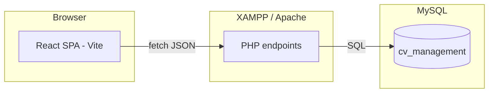

<<<<<<< HEAD
# CVFlow

CVFlow is a web application for **creating, storing, and discovering CVs**. It targets three personas—job seekers, employers, and administrators—with a **glass-style UI** (inspired by tools like Attio and Linear) built in React. Data lives in **MySQL** and is exposed through small **PHP JSON endpoints** that the SPA calls over HTTP.

---

## Features

### Authentication & roles

- **Login** and **registration** with a chosen role (`seeker`, `employer`, or `admin`).
- **Role-based navigation**: each role sees only the sections that apply to them.

### Job seekers

- **Dashboard** showing a read-only summary of the signed-in user’s CV.
- **My CV** editor with tabbed sections: personal info (including CV category), address (cascading country → city → district), education, work history, skills (with proficiency), and certificates.
- **Save** sends structured data to the backend; lookups (dropdowns) are loaded from the API.

### Employers

- **Dashboard**: grid of **all candidates** who have a CV; open a **modal** to view a full profile.
- **Search**: **keyword** search plus filters (category, location, skills, minimum proficiency, degree level, institution), **sorting** (recent, alphabetical, experience), **pagination**, and in-place **candidate profile** preview.

### Administrators

- **User directory** with search and role filter, plus **aggregate stats** (totals by role, active CVs, etc.).
- **Lookup management**: create, update, and delete shared reference data (skills, CV categories, degree levels, majors, industries, employment types, certificates, countries, cities, districts—with parent context where needed).

---

## Tech stack

| Layer | Technologies |
|--------|----------------|
| **Frontend** | React 19, TypeScript, Vite 6, Tailwind CSS 4 (`@tailwindcss/vite`), Motion, Lucide React |
| **Backend** | PHP (mysqli), JSON responses, CORS headers for browser access |
| **Database** | MySQL (default DB name in code: `cv_management`) |
| **Hosting (typical)** | XAMPP / Apache for PHP + MySQL; Vite dev server for the UI |

---

## Architecture / system design

### High-level layout

- **Single-page application** (`frontend/`): one main `App.tsx` coordinates auth state, CV state, and views; `api.ts` centralizes HTTP calls; shared types live in `types.ts`; reusable glass UI primitives in `components/GlassUI.tsx`.
- **Backend** (`backend/`): one PHP file per concern (e.g. `auth.php`, `register.php`, `cv.php`, `search_cvs.php`, `lookups.php`, `admin_users.php`, `admin_lookups.php`). Each script sets JSON content type, handles **OPTIONS** preflight where needed, reads/writes the database, and returns JSON.
- **Configuration**: the frontend uses `VITE_BACKEND_URL` when set; otherwise it defaults to a local Apache path (see `frontend/src/api.ts`). Database credentials are in `backend/database.php`.

### Data model (conceptual)

- **Identity**: `users` joined to `roles`.
- **CV core**: `cvs` linked to `cv_categories`; related rows in `cv_addresses`, `cv_education`, `cv_work_history`, `cv_skills`, and certificate tables, with foreign keys into **lookup** tables (institutions, degree levels, majors, job titles, employment types, industries, skills, proficiency levels, certificates, issuing organizations, geography).

### Search

- `search_cvs.php` builds a parameterized query over CVs and related tables, supports **filters** and **pagination**, and computes an **experience-years** signal from work history for sorting.

---

## Repository layout

- `frontend/` — Vite + React + TypeScript client
- `backend/` — PHP API scripts and DB connection helper
